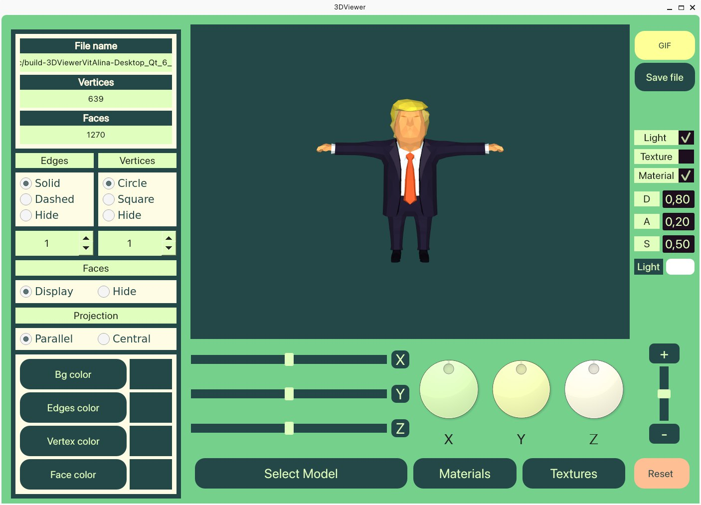

# 3D Viewer с использованием OpenGL и Qt Creator

Проект 3D Viewer представляет собой простое приложение для просмотра трехмерных моделей с использованием библиотек OpenGL и Qt Creator.



## Особенности

- Отображение трехмерных моделей в реальном времени.
- Возможность вращения, масштабирования и перемещения моделей.
- Поддержка форматов файлов для трехмерных моделей (OBJ).

## Требования к системе

- Qt Creator версии X.X.X или выше.
- OpenGL версии X.X или выше.
- Операционная система: Windows / Linux / macOS.

## Установка

1. Клонируйте репозиторий на свой компьютер:

    ```
    git@github.com:ra5kolnikov/3DViewer.git
    ```

2. Откройте проект в Qt Creator.
3. Соберите и запустите проект.

## Использование

- Откройте приложение.
- Загрузите трехмерную модель через "Select Model".
- Загрузите материалы через "Materials".
- Загрузите текстуры через "Textures".
- Используйте интерфейс для вращения и масштабирования модели.
